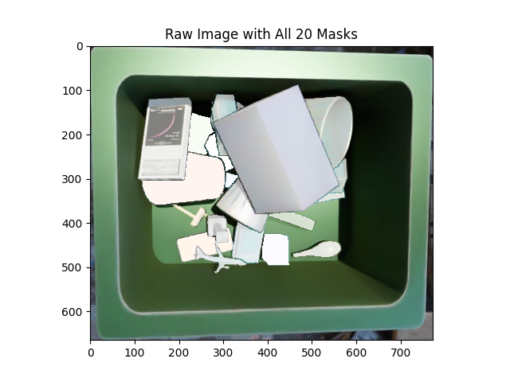
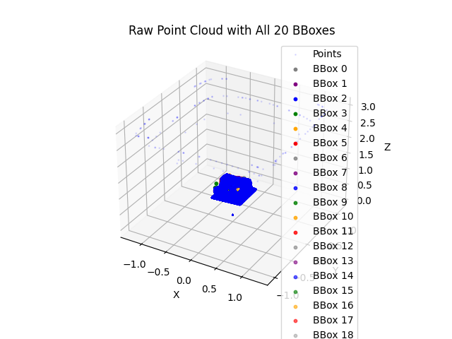
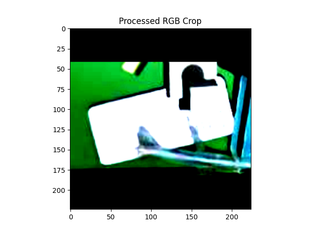
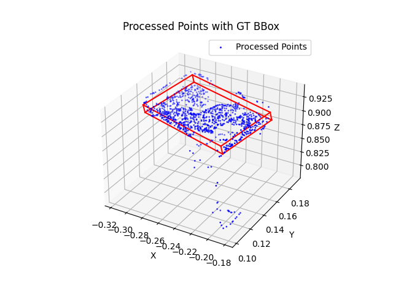
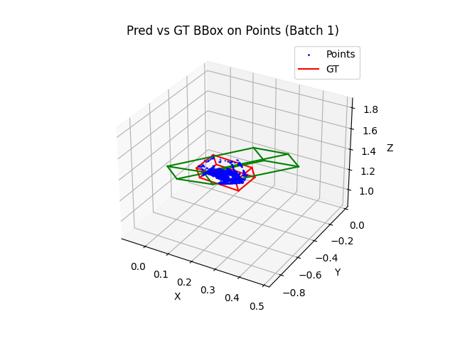

# 3D Bounding Box Prediction

Complete implementation with all required components (preprocessing, data loading, custom multimodal model and hybrid losses, train/eval loops, unit tests, and ONNX export) in a well-structured repository. Custom choices include 3D bounding box parametrization using center/dimensions/quaternions, canonical losses for symmetry handling, and consistent multimodal augmentations—detailed in README with justifications.

After limited testing with several loss functions (constrained by time and compute), it shows promising convergence but does not perform well yet and needs further tuning based on training/validation logs (already available). See README for loss metrics and example outputs.

Main files:
- README.md: Documentation of approach, architecture/loss choices, metrics, and visualizations.
/src: Python scripts for core functionality (e.g., dataset.py, model.py, train.py, eval.py, utilities, tests).

Additional files:
/runs: Training and validation logs from TensorBoard logger.
/models: Best models for different loss configurations (see main.py for definitions) after 5 epochs.
/vis: Visualizations of raw data, processed data, and evaluation results.

Run main.py to reproduce training/evaluation.

**Contents**
- [Data Processing, Augmentation, & Parametrization](#data-processing-augmentation--parametrization)
- [Loss Functions](#loss-functions)
- [Model Architecture](#model-architecture)
- [Training](#training)
- [Evaluation](#evaluation)
- [Visualization](#visualization)

## Data Processing, Augmentation, & Parametrization

### Raw Input
- RGB image `rgb.jpg` (H x W x 3)
- Instance masks `mask.npy` (N x H x W)
- Point cloud `pc.npy` (3 x H x W)
- Ground truth 3D bbox corners `bbox3d.npy` (N x 8 x 3 corners)

Where N is the number of objects in the scene (around 1-20 per image)

### Data Processing

[src/dataset.py](src/dataset.py)

- Mask:
    - expand to include the surrounding context (default: 5 pixels)
- Point Cloud:
    - filter to only include the points inside the expanded mask
    - sample to MAX_POINTS (default: 1024)
- RGB Image:
    - crop to the bbox size of the mask, resize while preserving aspect ratio with black padding
    - resize to 224x224 (ResNet input size, balance between information preservation and efficiency)

### Data Augmentation

[src/utils/augmentation.py](src/utils/augmentation.py)

Optional augmentations to enhance data diversity:
- Flip (horizontal/vertical)
- XY Translation (shift_x, shift_y)
- Z Rotation (angle_z)
- Scale (factor)

Designed to be consistent between data types: if the image is flipped, the points and bbox are flipped in the same way. Similarly, the points and bbox are translated in the same way etc. This is important for learning useful mappings between the different data types.

### Bounding Box Parametrization

[src/utils/bbox_conversion.py](src/utils/bbox_conversion.py)

Instead of using corners directly (8 x 3), we use the following parameters (10):
- Center (x, y, z)
- Dimensions (x, y, z)
- Rotation: Quaternion (x, y, z, w)

Downsides of using corners directly (8 x 3) for bbox prediction:
- Many parameters to learn: 24
- 8! options to represent the same bbox (i.e.. 8 corners can be permuted in 8! ways)

Upsides of using parametrization:
- 10 parameters to learn instead of 24
- Less options to represent the same bbox: unique center, dims & quat are interdependent (i.e. 3! options to represent the same bbox but this is addressed by canonicalization in the loss function)
- Quaternions avoid gimbal lock

### Processed Output
- RGB crops `rgb_crops` (N x 3 x 224 x 224)
- Points `points` (N x 1024 x 3)
- Targets `targets` (N x 10)

## Loss Functions

[src/utils/losses.py](src/utils/losses.py)

HybridLoss combines multiple components with adjustable weights (summing to 1.0) to address position, size, orientation, and geometry:

Params-based losses:
- **Center Loss**: Relative L1 on centers normalized by GT diagonal—focuses on position accuracy, scale-invariant.
- **Diagonal Loss**: Relative L1 on dim norms—promotes overall bbox scale without per-axis bias.
- **Quat Loss (`angular_loss_basis`)**: Minimal angular distance via rotated basis vectors, handling symmetries (e.g., axis permutations and direction flips via abs dot)—chosen for bbox rotational equivariance, avoiding high penalties for equivalent orientations. However, it does not promote dimensions that are consistent with the quaternion.
- **Canonical Loss (`canonical_dims_quat_loss`)**: Sorts dims descending, reorders bases, computes combined dims + angular loss—addresses 3! dim permutations, ensuring consistent learning regardless of axis assignment. This effectively captures the interdependency between dimensions and quaternions and is combined loss on both

Corner-based losses:
- **Corner Distance Loss**: L1 on matched corners (Hungarian assignment) normalized by diagonal—ensures geometric fidelity.
- **Projected IoU Loss**: Multi-plane (xy/xz/yz) IoU—holistic overlap metric for 3D alignment.

Combinations that effectively capture all properties:
- Center + Diag + Quat
- **Center + Diag + Canonical**
- **Corner** + ...
- IoU + ...

## Model Architecture

[src/model.py](src/model.py)

`ThreeDBBoxModel` is a multimodal fusion network:

- RGB branch: Pretrained ResNet-18, adapted to 512-dim output—leverages imageNet features for appearance/texture.
- Point branch: Simple PointNet (MLPs + max-pool) to 512-dim—permutation-invariant for unordered points, extracts geometry.
- Fusion: Concat + linear (1024->256) + dropout + head to 10 params (center, dims, quat normalized).[1][2]
- Inputs: Per-object RGB crops (B x 3 x 224 x 224), points (B x 1024 x 3).

Reasoning:Fusion balances modalities (RGB for context, points for 3D)—ResNet proven for vision, PointNet lightweight for points. Quat output avoids gimbal lock. Per-object design handles variable N efficiently.

## Training

[src/train.py](src/train.py)

Splits data (80/10/10), uses `BBoxDataset` with augs (toggled via flags, prob=0.5). Adam optimizer (LR=1e-3, decay=1e-5), gradient accumulation (steps=5 for stability), ReduceLROnPlateau scheduler, early stopping (patience=3). Logs total + component losses to TensorBoard/prints per batch/epoch.

Hyper-params (config.py): EPOCHS=5, BATCH=16, MAX_POINTS=1024—small for quick iterations on limited data.

Reasoning: Accum/scheduler prevent overfitting; detailed logging tracks components (e.g., high quat loss -> enable rot aug). Multi-model training via dict weights compares losses.

Example Log:
```
Train dataset size: 160, Val dataset size: 20
Train loader length: 10, Val loader length: 2

Resumed from epoch 5

Epoch 6/10 - Batch 0/10 - Train Loss: 0.1711 - Val Loss: 1.6785
- Losses: {'center': 1.4943273663520813, 'diag': 3.064611554145813, 'quat': 0.5378780663013458, 'canonical': 0.0, 'corner': 0.0, 'iou': 0.0}
...

Epoch 6/10 - Batch 9/10 - Train Loss: 0.8776
- Losses: {'center': 0.9324046969413757, 'diag': 1.1189152002334595, 'quat': 0.5633459091186523, 'canonical': None, 'corner': None, 'iou': None}

Epoch 6/10 - Avg Train Loss: 0.4639 - Avg Val Loss: 4.1202

Saved best model
```

## Evaluation

[src/eval.py](src/eval.py)

Loads best model, computes avg total + component losses on test set (e.g., center error, quat angle, IoU). Optional batch visualization of pred/gt bboxes on points.


Example Output:
```
Evaluating canonical with loss weights: {'center': 0.3, 'diag': 0.1, 'quat': 0.0, 'canonical': 0.6, 'corner': 0.0, 'iou': 0.0}

Avg Losses: {'center': 2.9870, 'diag': 1.1964, 'quat': 0.0, 'canonical': 1.0838, 'corner': 0.0, 'iou': 0.0}
```

## Visualization

[src/utils/visualization.py](src/utils/visualization.py)

- Raw: Image + masks; 3D points + bboxes (colored per object).
- Processed: Cropped RGB; points + GT bbox.
- Results: Points + pred (green) vs GT (red) bboxes. 

Examples (descriptions; see vis_* folders):
- Raw: Cluttered scene with multi-colored masks/bboxes.
- Processed: Augmented crop (rotated); scaled points with enlarged bbox.
- Results: Good: Green overlaps red; Poor: Offset shows high center loss.
- Breakdown: High bars on samples 3-5 indicate outliers.

### Raw

| Raw Image | Raw Point Cloud |
|---|---|
|  |  |


### Processed

| Processed RGB Crop | Processed Points |
|---|---|
|  |  |


### Results




## Status & Next Steps

Current results show promising convergence; next: longer training for refinement with more detailed analysis of training logs for hyperparameter tuning and more detailed testing of loss functions.

## Testing

- [src/test/test_augmentations.py](src/test/test_augmentations.py)
- [src/test/test_dataset.py](src/test/test_dataset.py)
- [src/test/test_losses.py](src/test/test_losses.py)
